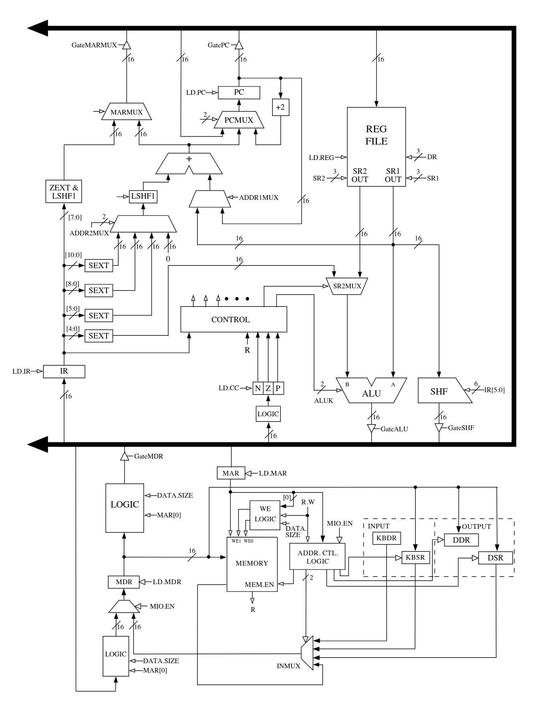
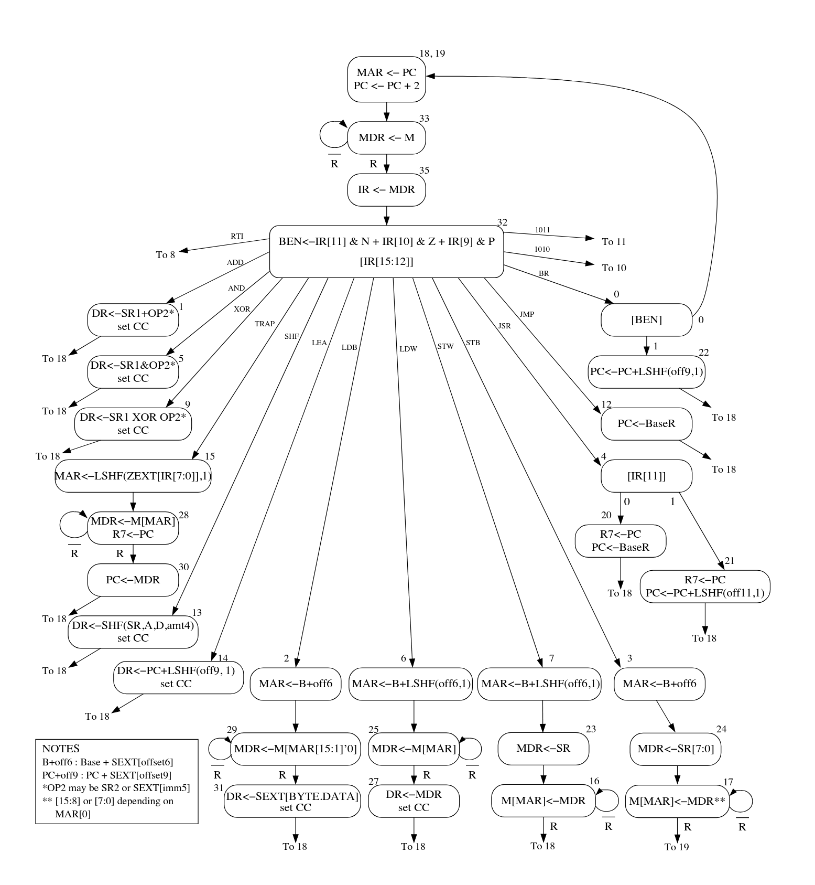

<!-- # lc-3b-sim
Simulating a microarchitecture that implements part of the LC-3b ISA specification

The goal for this project is to learn how CPU microarchitecture while abstracting away transistor/latch/flip flop/logic gate design. 

## Todo:

> Adding to this list as I go

- [x] Build data path
  - [x] Adder
  - [x] ALU
  - [x] Register Interface
  - [x] Register File
  - [x] Memory
  - [x] Special registers
  - [x] Bit shifter
  - [x] Multiplexers
  - [x] Sign extender
- [x] Build control logic
  - [x] Microcode in the form of the control store
  - [x] Microsequencer


## LC-3b Microarchitecture 



## LC-3b Finite State Machine
 -->


# LC-3b Functional Simulator & Profiler

A functional simulator for *most of* the LC-3b (Little Computer 3) instruction set architecture, implemented in Go. The goal for this project was to learn CPU microarchitecture while abstracting away transistor/latch/flip flop/logic gate design.

## Quick Start

To define a program, load a uint16 slice into the simulator's memory and invoke the Run loop:

```go
package main

import (
	"lc3b-sim/m/v2/cpu"
	"log/slog"
	"os"
)

func main() {
	var cpu cpu.CPU

	pcStart := uint16(0x3000)
    // Example Store and Retrieve: calculates a memory address, writes a value to it, and then reads it back to verify the round-trip.
	instructions := []uint16{
		0xE006, // LEA R0, #6 (Load Effective Address)
		0x5260, // AND R1, R1, #0 (Clear R1)
		0x1267, // ADD R1, R1, #7 (Set R1 = 7)
		0x7200, // STW R1, R0, #0 (Store Word)
		0x6400, // LDW R2, R0, #0 (Load Word)
		0xF025, // HALT
		0x0000, // Padding (0x300C)
		0xFFFF, // STORAGE SLOT (0x300E)
	}

	cpu.Init(pcStart, instructions, *slog.New(slog.NewTextHandler(os.Stdout, nil)))
	cpu.Run()
}
```


## Core Features
- Partial ISA Implementation: Supports all standard LC-3b opcodes, including byte-level operations (LDB, STB) and word-aligned operations (LDW, STW). 
> Doesn't support memory mapped I/O for interrupts and processor status register (PSR) for privilege modes
-  Byte-Addressable Memory: Implements the 64KB memory space with the specific LC-3b byte-enable logic, allowing for granular data manipulation.
-  Instruction Profiling: Includes built-in telemetry that captures execution metrics such as total cycles, instruction count, and CPI (Cycles Per Instruction).
-  Structured Logging: Uses Go’s slog package for granular debug visibility into register transitions and memory-mapped I/O.
-  Condition Code Engine: Accurate tracking of N (Negative), Z (Zero), and P (Positive) flags for complex control flow.


## Performance & Telemetry

The integrated profiler generates a comprehensive report upon a HALT instruction, providing insights into the efficiency of the executed program.

```
=============================================
          CPU PROFILER FINAL REPORT         
=============================================
Status:    HALTED (TRAP 0x25)
Runtime:   316.81µs (Simulated)
---------------------------------------------
EXECUTION:
  Instructions:    6         
  Total Cycles:    66        
  Avg CPI:         11.00     
  
MEMORY:
  Reads:           8         
  Writes:          1         
  Total Accesses:  9         
  Intensity:       1.50 ops/inst

BRANCHING:
  Taken:           0         
  Not Taken:       0         
---------------------------------------------
```

## Technical Implementation

### Data Path
I created all the data path elements except for IO registers based on the microarchitecture below provided by the Patt and Patel book. I made all combinational elements like MUXs, shifter, extenders, and the ALU into Go functions, and I treated sequential elements like registers and memory write as how they do in reality - on the rising or falling edge of the clock. Reads on registers I treated as combinational.

<center></center>

### Finite State Machine (FSM)
The "microcode" to model the FSM below provided by Patt and Patel Appendix C is implemented as a hashmap where key is the current microinstruction, and value is a struct that includes all the control signals and conditionals needed to determine the next microinstruction.

<center></center>
